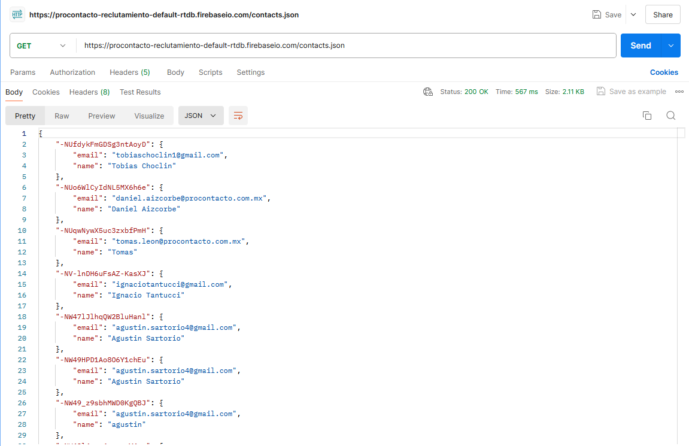
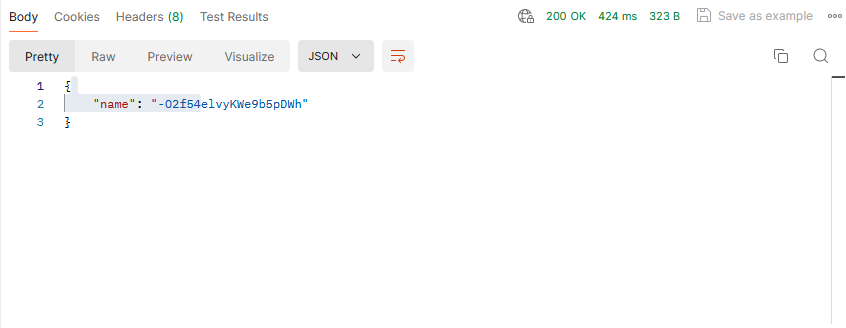
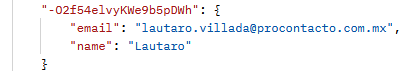
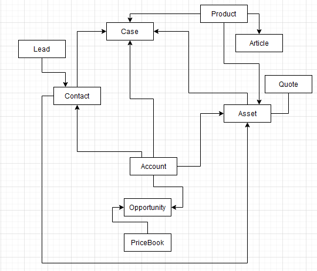

# special-broccoli

Repositorio para la resolución de algunos ejercicios.

### Ejercicio 1: 
**Instalar Visual Studio Code, Git y Git Bash**


### Ejercicio 2:

1.	**¿Qué es un servidor HTTP?**
Un servidor HTTP (constituído tanto de software como de hardware) es un servidor que utiliza el protocolo HTTP para transferir datos. La idea es que este está conectado a internet y se le puede pedir documentos a través de un __request__. Este los va a proporcionar, si los tiene, con una __response__ (o, en caso contrario, un error 404) a la máquina que lo pidió. Estos servidores se acceden por una URL y en general contienen la información de una página web (HTML, CSS, etc.), de esta forma posibilitando su acceso a cualquier usuario de internet.

2.	**¿Qué son los verbos HTTP? Mencionar los más conocidos.**
Los verbos HTTP más conocidos son __POST__, __GET__, __PUT__ y __DELETE__. Son, en esencia, un pedido de la ejecución de una acción sobre un recurso dado en el servidor. Por ejemplo, borrar, actualizar, pedir, etc.

3.	**¿Qué es un request y un response en una comunicación HTTP? ¿Qué son los headers?**
Un __request__ es un pedido que se le hace al servidor. Por ejemplo, si quiero alguna información en él, le voy a hacer un __request__ con el verbo __GET__.
Una __response__ es la respuesta de ese servidor a mi __request__, que no necesariamente debe ser positiva.

4.	**¿Qué es un queryString? (En el contexto de una url)**
Un __query string__ es un agregado a una URL que puede servir de información tanto para el navegador del usuario como para el servidor que lo recibe.
Son muy comunes por ejemplo al completar formularios o al hacer búsquedas en un buscador.

5.	**¿Qué es el responseCode? ¿Qué significado tiene los posibles valores devueltos?**
El __Response Code__ es un código que representa el tipo de __response__ que se dió a un __request__. Hay 5 grupos de respuestas estándar, aunque pueden existir otras específicas para cada software:
    - Del `100` al `199`, la respuesta contiene algún tipo de información proporcionada por el servidor, y significa que por alguna razón u otra aún no se completó de forma correcta. Por ejemplo un __response code__ `102` significa que el servidor sigue procesando el __request__ y que aún no puede proporcionar una __response__ acorde.
    - Del `200` al `299`, el servidor nos está informando que el __request__ se pudo hacer correctamente. Por ejemplo, `200` si se completó correctamente la acción o `202` cuando se recibe un __request__ correctamente, pero otro proceso lo maneja.
    - Del `300` al `399`, implica que es necesaria una redirección. Por ejemplo `300` significa que hay más de una respuesta del servidor posible, y es necesario elegir una; o `301` o `302` si la URL cambió permanentemente o temporalmente, respectivamente.
    - Del `400` al `499`, hay un error del lado del cliente. Por ejemplo, el famoso `404` significa que el servidor no encontró el recurso que el cliente pedía en su __request__; el `403`, que el cliente no tiene acceso a ese recurso; el `400` que hay un error en el formato del __request__, etc.
    - Del `500` al `599`, hay un error del lado del servidor. Por ejemplo, el famoso `502`, donde el servidor actuando como intermediario, recibió una respuesta inválida; el `504`, donde el servidor actuando como intermediario no recibe una respuesta a tiempo, etc.

6.	**¿Cómo se envía la data en un Get y cómo en un POST?**
En __GET__ la data se va a enviar en la URL, al final de esta como pares de **parámetro=valor** y separados por **&**. En __POST__, la data no es visible en la URL, y se hace en una comunicación a parte con el servidor (por ejemplo con un script de php) y también como pares de **parámetro=valor** separados por **&**.

7.	**¿Qué verbo http utiliza el navegador cuando accedemos a una página?**
__GET__

8.	**Explicar brevemente qué son las estructuras de datos JSON y XML dando ejemplo de estructuras posibles.**
**JSON** significa __JavaScript Object Notation__ y como el nombre dice, es un tipo de notación (no necesariamente un tipo de archivo) para el intercambio de información. La idea es que sea facil de generar y entender. Los "objetos" de JSON son pares de **parámetro:valor** y el valor puede ser un dígito, número, string o un tipo de dato más complicado como un array u otro objeto, o cualquier combinación de los anteriores.
Un ejemplo de un JSON básico para un safari:

```
{
    "Estado": "abierto",
    "Clientes": 9,
    "Personal": 15,
    "Animales": [
        {
            "Nombre": "León",
            "NivelPeligro": 2,
            "Cantidad": 199
        },
        {
            "Nombre": "Elefante",
            "NivelPeligro": 2,
            "Cantidad": 153
        },
        {
            "Nombre": "Jirafa,
            "NivelPeligro": 1,
            "Cantidad": 237
        }
    ]
}
```

Por otro lado **XML** significa __Extensible Markup Language__ y es una forma de estandarizar y estructurar información de forma que sea fácil de compartir.

```
<safari>
    <estado> abierto </estado>
    <clientes> 9 </clientes>
    <personal> 15 </personal>
    <animales> 
    
        <animal1>
            <nombre> León </nombre>
            <NivelPeligro> 2 </NivelPeligro>
            <Cantidad> 199 </Cantidad>
        </animal1>
        
        <animal2>
            <nombre>  Elefante </nombre>
            <NivelPeligro> 2 </NivelPeligro>
            <Cantidad> 153 </Cantidad>
        </animal2>
        
        <animal3>
            <nombre> Jirafa </nombre>
            <NivelPeligro> 1 </NivelPeligro>
            <Cantidad> 237 </Cantidad>
        </animal3>
        
    </animales>
</safari>
```

9.	**Explicar brevemente el estándar SOAP.**
El estándar **SOAP** __(Simple Object Access Protocol)__ es un protocolo de intercambio de información que usa HTTP para el intercambio de mensajes a través de documentos XML.

10.	**Explicar brevemente el estándar REST Full.**
**RestFul** es una API basada en la arquitectura de software __REST__ (Representational State Transfer) que permite el intercambio de información entre softwares diferentes de forma segura y confiable.

11.	**¿Qué son los headers en un request? ¿Para qué se utiliza el key Content-type en un header?**
Los **headers** de un __request__ son espececificaciones hechas por el cliente en relación a la respuesta que quiere recibir. Por ejemplo, indicar formatos preferidos (idioma, datos, condiciones, etc.), proveer autenticación, manejo de cookies, etc. El key **content-type** provee el tipo de contenido original del recurso, antes de cualquier tipo de cambio hecho por el protocolo HTTP para mandarlo. Por ejemplo JSON, XML, ZIP, mp4, csv, formulario, etc.


### Ejercicio 3

GET:




POST:



GET:



La diferencia: el contenido de mi POST ahora aparece en el GET.


### Ejercicio 4

> https://www.salesforce.com/trailblazer/jbkj5ch0shwygflc2i


### Ejercicio 5

1.	**Lead:** personas o compañías interesadas en tu producto o servicio.
    - Dirección
    - Mail
    - Descripción
    - Teléfono
    - Producto de Interés
    - Industria
    - Sitio Web
    - Título
    - Contacto
    etc.

2.	**Account:** compañias con la que se está haciendo negocios.
    - Nombre de la Cuenta
    - Número
    - Prioridad
    - Descripción
    - Empleados
    - Industria
    - Sitio Web
    - Dirección de Envio
    - Activo (si/no)
    - Ganancia Anual
    - Sucursales
    - etc.

3.	**Contact:** persona con la que el equipo de trabajo se mantiene en contacto frecuentemente.
    - Nombre
    - Nombre de la Cuenta
    - Fecha de Nacimiento
    - Mail
    - Asistente
    - Teléfono del Asistente
    - Idiomas
    - Jefe
    - Título
    - Dirección de Envio
    - No llamar (si/no)
    - etc.

4.	**Opportunity:** transacciones en proceso.
    - Nombre de la Cuenta
    - Cantidad
    - Ganancia Esperada
    - Estado de la Entrega/Instalación
    - Próximo Paso
    - Nro. de Orden
    - Price Book
    - Competidores
    - Nro. de Tracking
    - Tipo
    - etc.

5.	**Product:** productos o servicios que la compañia vende a los clientes.
    - Activo
    - Display URL
    - Código de Producto
    - Nombre del Producto
    - Descripción del Producto
    - Tipo de Producto
    - Vendedor
    - Cantidad
    - etc.

6.	**PriceBook:** lista de productos y sus precios .
    - Activo
    - Descripción
    - Es el PriceBook Standard (si/no)
    - Nombre

7.	**Quote:** precio propuesto para una instancia de producto o servicio.
    - Precio
    - Producto
    - Cantidad de Producto
    - Razón/Descripción/Detalle
    - etc.

8.	**Asset:** una instancia de producto o servicio ya vendido/instalado/entegrado, etc.
    - Cuenta
    - Dirección
    - Nivel
    - Proveedor
    - Seriviciado por
    - Contacto
    - Fecha de Instalación
    - Ganancia Mensual
    - Fin de Ciclo de Vida de Asset
    - Producto
    - Fecha de Compra
    - etc.

9.	**Case:** pregunta, sugerencia o problema de un cliente.
    - Asset
    - Cuenta
    - Origen
    - Contacto
    - Descripción
    - Creado por
    - Razón
    - Potencialmente Problemático (si/no)
    - Producto
    - Prioridad
    - etc.

10.	**Article:** documento o información sobre procesos, productos, servicios, etc.
    - Producto
    - Texto
    - etc.




*** Ejercicio 6 ***

**Soluciones de Salesforce**
    A. Es una plataforma virtual que permite tener varios entornos relacionados a una empresa en un mismo lugar, y tenerlos fácilmente conectados. Sea ventas, servicios al cliente, marketing, operaciones comerciales o base de datos, todos pueden estar integrados dentro de Salesforce.
    B. Una plataforma de Salesforce que da seguimiento al proceso de ventas, desde contacto inicial hasta la compra del producto.
    C. Es una plataforma de Salesforce centrada en empresas que ofrecen servicios: sirve para agilizar la atención al cliente y para recursos de autoayuda en caso de que el usuario tenga dudas, además de conectarlo con otros usuarios.
    D. Es una plataforma de Salesforce especializada en sistemas de salud. Permite conectar a los profesionales de la salud entre ellos y con los clientes, facilitando y automatizando procesos relacionados.
    E. Es una plataforma de Salesforce para automatizar campañas de marketing.

**Funcionalidades de Salesforce**
    A. RecordType es una forma de identificar diferentes tipos de un mismo objeto. Es como el polimorfismo. Es decir, varios objetos pueden ser **animales**, pero algunos además son **aves**, otros **mamiferos** y otros **reptiles**.
    B. ReportType es una forma de separar diferentes tipos de reportes. Los reportes son información y data sobre algo. Los varios tipos de reportes estándar se adecúan a diferentes tipos de información normalmente recopilada. También hay RecordTypes custom.
    C. Los PageLayouts son las vistas que tienen los usuarios, y determinan qué pueden ver y editar en un Record.
    D. Un **CompactLayout** es la configuración que determina los campos que se ven imediatamente cuando se abre un Record.
    E. Es la configuración que se asigna a un usuario cuando se crea.
    F. Los roles determinan a qué Records tienen acceso cada usuario.
    G. Es un verificador que se asegura de que la información que ingresa un usuario es acorde a los estándares especificados.
    H. Las diferencias son varias. Por ejemplo: a diferencia de las **Lookup**, las **Master-Detail** requieren que exista el campo padre si o si. En otro caso, el hijo no puede existir; el hijo hereda la seguridad del padre. Un objeto solo puede tener hasta dos objetos padres (a diferencia de las lookup con 40 o 25 depende de si el objeto es o no custom). También las **Master-Detail** tienen accesso a los rollup summaries y las **Lookup** no.
    I. Un **Sandbox** es una copia de tu organización en un entorno separado que se puede usar para entrenamientos y testeos, etc.
    J. Un **Change Set** es una herramiento para migrar metadata de un entorno de Salesforce a otro.
    K. El **Import Wizard** es una herramienta para importar data desde Salesforce. Hasta 50000 records a la vez.
    L. **Web to Lead** es una funcionalidad que permite conseguir información de la gente que visita una página web y automáticamente guardar ésta información como un Lead dentro de Salesforce.
    M. **Web to Case** es una funcionalidad que permite el seguimiento de problemas de clientes, servicios y soportes desde mails o una página web directo de Salesforce.
    N. **Omnichannel** es una funcionalidad que permite integrar la información de mails, llamadas de teléfono y otros medios de atención al cliente para proveer la mejor atención posible.
    O. **Chatter** es una herramiento de Salesforce que permite colaborar entre varios usuarios. Funciona como una red social de los empleados de una organización. 

**Conceptos Generales**
    A. **SaaS**, _Software as Service_, es la venta de software por subscripción, hosteado en la nube, en vez de una compra de una vez que requiere instalación.
    B. Algunas partes de Salesforce son SaaS, otras no. Su producto base, la plataforma CRM (_Customer Relationship Management_) se considera SaaS.
    C. **Cloud** significa que la solución (sea un software, aplicación, información) está en un servidor a parte, perteneciente a la misma empresa que proporciona la solución o al de un tercero, en vez de en la computadora del cliente.
    D. **On-Premise** es la contrario de Cloud, es decir, en la computadora, casa u oficina del cliente.
    E. **Sales Pipeline** es una forma de estructurar y organizar potenciales ventas y administrar y visualizar como progresan por sus diferentes etapas.
    F. Un **Sales Funnel** es el proceso que posibles clientes tienen que hacer para concretar su compra. Está definido en etapas y establece qué debe hacer la compañía en cada etapa para asegurar que esta se complete y se haga la venta.
    G. La **Customer Experience** es, como el nombre lo dice, la experiencia del cliente con un producto o servicio, incluída la venta, el ciclo de vida del producto, el soporte, etc.
    H. El **Omnichannel** es una estrategia de comercio que pretende dar una experiencia al consumidor buena, integrando todos los posibles canales: sea en una página web, mails, teléfono, mensajes, etc.
    I. **B2B** significa _Business to Business_, es decir, transacciones entre dos empresas. Por ejemplo, para materia prima, servicios o reventas.
       **B2C** significa _Business to Consumer_, es decir, la venta de un producto de la empresa que lo hace directamente al cliente.
       **KPI** significa _Key Performance Indicator_, y son basicamente mediciones o valores cuantificables que permiten evaluar el rendimiento de la empresa a largo plazo.
    J. **API**, _Application Programming Interface_, es una forma de un software para proveerle un servicio a otro software. **REST APIs**, a diferencia de una **API** normal, se conecta a través del protocolo HTTP.
    K. El **Batch Processing** es un método para procesar un alto volumen de data de forma más eficiente, automáticamente.
    L. **Kanban** se puede referir al método de manufactura (el original) o el adaptado a desarrollo de software. En el caso del de software, es un método que permite reducir cuellos de botella administrando los recursos humanos de forma en que trabajen de forma más eficiente en relación a las prioridades.
    M. **ERP**, _Enterprise Resource Planning_, es un tipo de software que se usa para administrar acitvidades diarias en una empresa. Como finanzas, manejo de proyectos y riesgos, etc.
    N. No. Salesforce no es un ERP.

